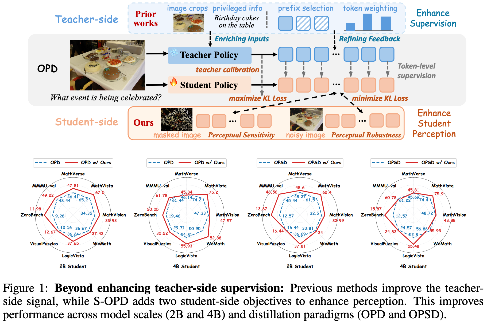
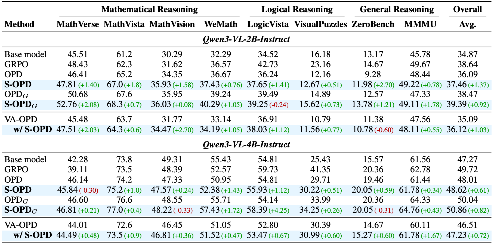
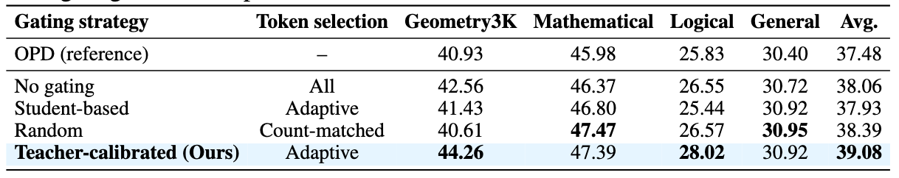

# Is Better Teacher Supervision Enough? Unlocking Student-side Learning in Multimodal On-Policy Distillation

<div align="center" style="margin-bottom:2em;">
  <a target="_blank" href="https://sirilaw.github.io">Siyuan Liu</a><sup>1</sup>,
  <a target="_blank" href="#">Kanghui Tian</a><sup>2</sup>,
  <a target="_blank" href="#">Yue Duan</a><sup>1</sup>,
  <a target="_blank" href="#">Yutao He</a><sup>1</sup>,
  <a target="_blank" href="#">Shangdong Yang</a><sup>3</sup>,
  <a target="_blank" href="https://koncle.github.io">Jian Zhang</a><sup>1</sup><sup>*</sup>,
  <a target="_blank" href="https://cs.nju.edu.cn/shiyh/">Yinghuan Shi</a><sup>1</sup><sup>*</sup>
  <br>
  <strong>
    <sup>1</sup>Nanjing University, <sup>2</sup>Fudan University, <sup>3</sup>Nanjing University of Posts and Telecommunications
  </strong>
  <br>
  <sup>*</sup> Corresponding author
  <br>
  <a href="https://arxiv.org/abs/2609.39120">Paper Link</a>
</div>

> Official implementation of **S-OPD**, a multimodal on-policy distillation framework that strengthens the student's visual perception instead of modifying only the teacher-side supervision signal.

## Overview

On-policy distillation (OPD) improves reasoning by providing token-level supervision from a teacher on a student's own trajectories. Existing methods primarily focus on enhancing this teacher-side guidance (e.g., by enriching teacher inputs and refining teacher feedback), yet we find that limited student perception is another critical bottleneck in multimodal OPD.  

To address this, we propose S-OPD, a simple multimodal on-policy distillation framework that explicitly strengthens student perceptual learning through two objectives. Specifically, *Teacher-calibrated Policy Contrast* separates student policies under original and masked images with teacher-based token-level gating, strengthening the student's reliance on visual evidence during reasoning. *Policy Agreement* aligns student policies under original and noise-perturbed images, further improving perceptual robustness to visual noise. Notably, our method can be seamlessly plugged into existing OPD frameworks, requiring no additional data annotations, model parameters or inference operations.

<p align="center">
    
    <br>
</p>

## Results

<p align="center">
    
    <br>
    <em>S-OPD achieves performance gains across reasoning domains, student model scales, and teacher advantages.</em>
</p>

<p align="center">
    
    <br>
    <em>Effectiveness of teacher-calibrated gating.</em>
</p>

## Environment Setup

Create the Conda environment and install the verl dependencies following the setup used by [THUNLP/OPD](https://github.com/THUNLP/OPD). The installation script installs the CUDA-enabled PyTorch/vLLM stack; run it on a compatible Linux machine with NVIDIA GPUs.

```bash
conda create -n sopd python=3.12 -y
conda activate sopd
USE_MEGATRON=0 bash scripts/install_vllm_sglang_mcore.sh
pip install -e .
python -m pip install "transformers==4.57.6"
```

The Transformers pin is required for the Qwen3-VL code used by this project. The install script installs vLLM and SGLang; `USE_MEGATRON=0` skips the optional Megatron components.

## Training
```bash
RAY_TMPDIR=/path/to/ray_tmp
OUTPUT_DIR=/path/to/output
data_train_path=/path/to/train/dataset
data_val_path=/path/to/val/dataset
bash examples/opd_trainer/run_qwen3_vl_2b.sh
```
For the main ViRL39K experiments, you can use MMK12 dataset for validation as in [this repo](https://github.com/MikeWangWZHL/PAPO). This is only for monitoring, and we DO NOT pick the checkpoint based on the validation acc.

## Evaluation

Evaluation uses [VLMEvalKit](https://github.com/open-compass/VLMEvalKit) through `evaluation/vlmevalkit/run_eval.sh`. First edit the **User configuration** block near the top of that script:

- Set `EVAL_PRIMARY_MODEL=true` and set `MODEL_PATH` to the trained checkpoint or base model directory. Set `MODEL_NAME` and `MODEL_ALIAS` to the desired output names.
- Set `GPU` to the visible GPU IDs, for example `"0,1,2,3"`.
- Select benchmarks using the `EVAL_*` switches and/or `BUILTIN_BENCHMARKS`. For a local dataset, add a `"benchmark_name|/path/to/manifest"` entry to `LOCAL_BENCHMARKS` and set `EVAL_LOCAL_BENCHMARKS=true`.
- Set `HF_HOME` to a writable directory for Hugging Face model and dataset caches, and set `EVAL_ROOT` to the desired evaluation output directory.

Then run:

```bash
bash evaluation/vlmevalkit/run_eval.sh
```

Built-in datasets may be downloaded on the first run. The script uses vLLM and greedy decoding by default; adjust `BACKEND`, `MAX_NEW_TOKENS`, or `SAMPLING_MODE` in its configuration block if needed. Results and logs are written under `EVAL_ROOT`.

## Citation

The paper is currently anonymous. Please use the temporary entry below and replace it with the public citation after de-anonymization.

```bibtex
@article{liu2026sopd,
  title={Is Better Teacher Supervision Enough? Unlocking Student-side Learning in Multimodal On-Policy Distillation},
  author={Liu, Siyuan and Tian, Kanghui and Duan, Yue and He, Yutao and Yang, Shangdong and Zhang, Jian and Shi, Yinghuan},
  journal={arXiv preprint arXiv:2609.39120},
  year={2026},
}
```

## Acknowledgements

This implementation is built on [verl](https://github.com/volcengine/verl) and [ViCuR](https://github.com/tiankanghui/ViCuR), uses [vLLM](https://github.com/vllm-project/vllm) for rollout and teacher inference, and uses [VLMEvalKit](https://github.com/open-compass/VLMEvalKit) for evaluation.

## License

This repository is released under the [Apache License 2.0](LICENSE).
